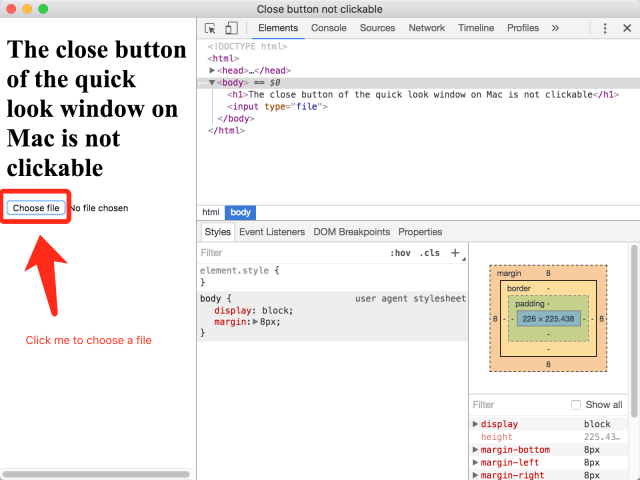
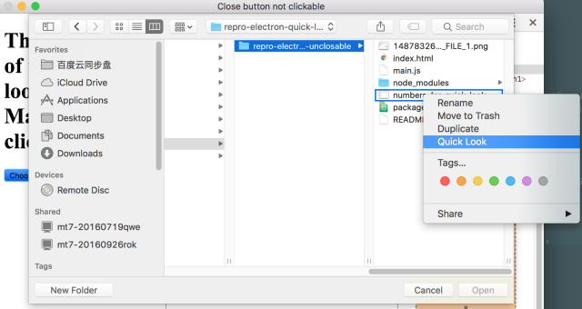
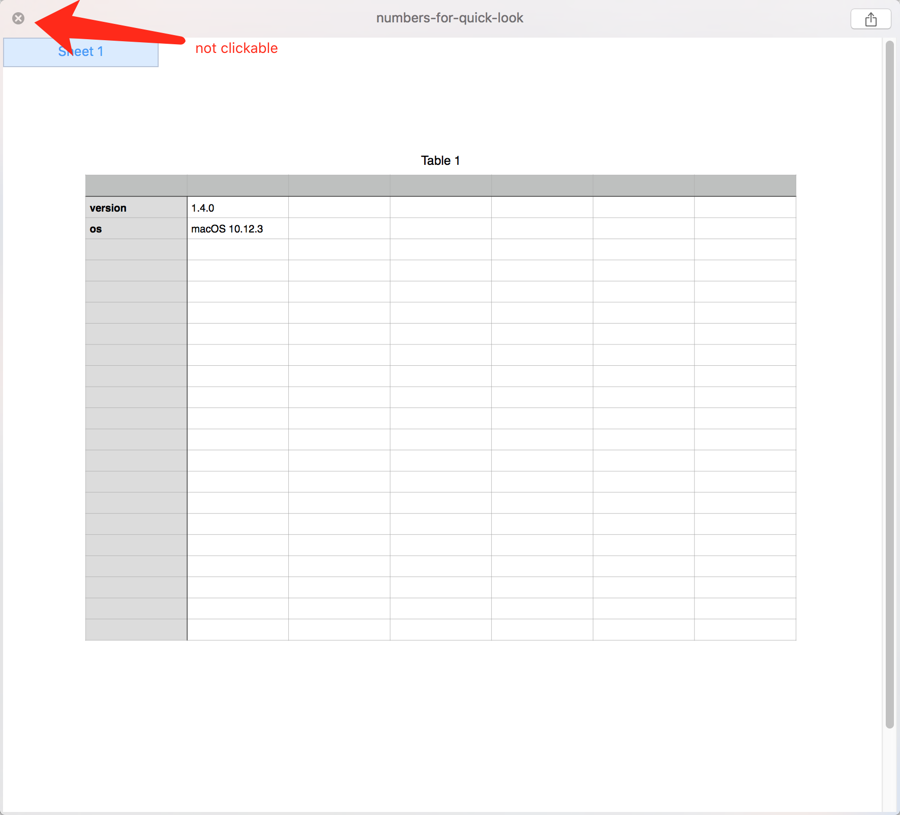

# repro-electron-quick-look-window-unclosable
Environment:
* operating system: macOS 10.12.3
* electron version: 1.6.1, 1.4.0

## How to reproduce the problem

Clone the repro repo and run `npm install`:

```bash
git clone https://github.com/zoubin/repro-electron-quick-look-window-unclosable.git
cd repro-electron-quick-look-window-unclosable
npm install

```

1. Start the demo with `npm start`
2. Click the file upload button to trigger the popup


3. Choose the `numbers` file given in the repo and click `Quick Look`


4. Now you will find the **close** button on the upper left is not clickable.


